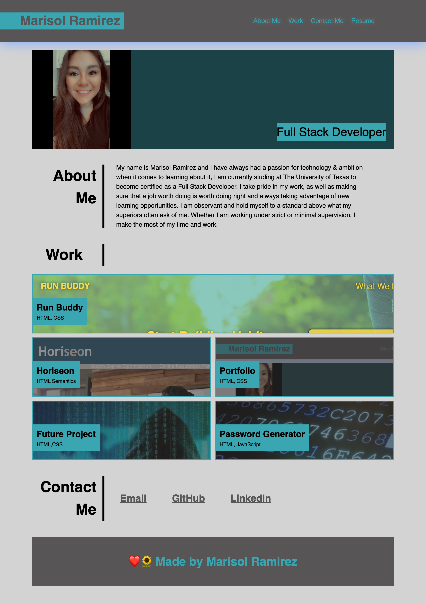

# Professional Portfolio
 
 The purpose of this assignment is to create a professional portfolio to show off finished projects to potential employers.

 ## Task List

- [x] Add work samples
- [x] Add placeholders for future projects
- [x] Add sections for my name, profile picture, about me, my work and contact information
- [x] Add the appropriate links to corresponding sections
- [x] Make first section of finished projects larger than the rest
- [x] Make sure the website is mobile responsive

## Languages used

* HTML
* CSS

# User Story 

AS AN employer
I WANT to view a potential employee's deployed portfolio of work samples
SO THAT I can review samples of their work and assess whether they're a good candidate for an open position

## Acceptance Citeria

GIVEN I need to sample a potential employee's previous work
WHEN I load their portfolio
THEN I am presented with the developer's name, a recent photo or avatar, and links to sections about them, their work, and how to contact them
WHEN I click one of the links in the navigation
THEN the UI scrolls to the corresponding section
WHEN I click on the link to the section about their work
THEN the UI scrolls to a section with titled images of the developer's applications
WHEN I am presented with the developer's first application
THEN that application's image should be larger in size than the others
WHEN I click on the images of the applications
THEN I am taken to that deployed application
WHEN I resize the page or view the site on various screens and devices
THEN I am presented with a responsive layout that adapts to my viewport

## Link to Github Repository

## Link to Deployed Application

# Screenshot

Here is a snapshot of the website:
* Work section is still being worked on and needs touch ups 

